<div align="center">
  
</div>

<h1 align="center">
  
</h1>

<div align="center">
  <a href="https://khalilkhalef.com">
    
  </a>
  <a href="https://www.linkedin.com/in/khalil-khalef/">
    
  </a>
  <a href="mailto:contact@khalilkhalef.com">
    
  </a>
</div>

<br/>

<div align="center">
  
</div>

---

## 🚀 About Me

```yaml
name: Khalil Khalef
located_in: Mauritania
current_job: 2nd Year Engineering Student
education: ["Software Engineering", "Computer Science"]
fields_of_interests: ["Web Development", "AI/ML", "Data Science", "Mobile Development"]
currently_learning: ["Advanced TypeScript", "Next.js", "AI Integration", "System Design"]
hobbies: ["Coding", "Problem Solving", "Tech Innovation", "Open Source"]
```


### 💫 What I'm passionate about:
- 🔭 Building **scalable software solutions**
- 🌱 Exploring the **intersection of AI and data science**
- 👯 Creating **clean, maintainable code**
- 🤔 Leveraging **AI-driven insights** for impactful solutions
- 💬 Always eager to **learn and collaborate**
- ⚡ Fun fact: I believe in the power of **simple and clean** solutions

<br clear="both"/>

---

## 🛠️ Tech Stack & Tools

<div align="center">

### 💻 Programming Languages


### 🌐 Frontend Development


### 📱 Mobile Development


### ⚙️ Backend & Database


### 🔧 Tools & Platforms


### 🤖 AI & Data Science


</div>

---

## 📊 GitHub Analytics

<div align="center">
  
  
</div>

<div align="center">
  
</div>

<div align="center">
  
</div>

---

## 🏆 GitHub Trophies

<div align="center">
  
</div>

---

## 🎯 Current Focus

```mermaid
graph TD
    A[🎓 Engineering Studies] --> B[💻 Software Development]
    B --> C[🤖 AI Integration]
    C --> D[🚀 Scalable Solutions]
    D --> E[🌟 Innovation]
    
    F[📚 Learning] --> G[⚛️ Advanced React/Next.js]
    G --> H[🧠 Machine Learning]
    H --> I[☁️ Cloud Technologies]
    I --> J[🏗️ System Design]
```

<div align="center">



</div>

---

## 💡 What I'm Learning

<div align="center">

| 🔥 Currently Exploring | 🎯 Next Goals | 🌟 Dream Projects |
|:---:|:---:|:---:|
| Advanced TypeScript | Cloud Architecture | AI-Powered SaaS Platform |
| System Design | DevOps & CI/CD | Open Source Contributions |
| AI/ML Integration | Microservices | Tech Startup |
| Performance Optimization | Mobile Development | Educational Technology |

</div>

---

## 🤝 Let's Connect & Collaborate

<div align="center">

### 💬 I'm always interested in:
- 🚀 **Innovative projects** that solve real-world problems
- 🤝 **Collaborating** with passionate developers
- 💡 **Learning** new technologies and methodologies
- 🌍 **Contributing** to open-source projects
- 🎓 **Sharing knowledge** and experiences

### 📫 How to reach me:
[](https://khalilkhalef.com)
[](https://www.linkedin.com/in/khalil-khalef/)
[](mailto:contact@khalilkhalef.com)

</div>

---

<div align="center">
  
</div>

<div align="center">
  <h3>⭐ From <a href="https://github.com/khalef-khalil">khalef-khalil</a> with ❤️</h3>
  <p><em>Building the future, one commit at a time</em> 🚀</p>
</div>
